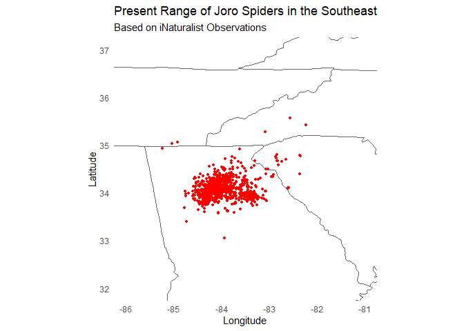
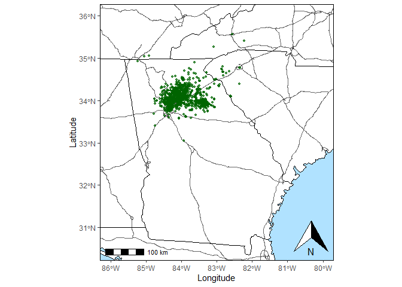

iNaturalist Mapping
================

-   [Data and R packages](#data-and-r-packages)
-   [Basic map](#basic-map)
-   [Better map](#better-map)

# Data and R packages

``` r
library(maps)
library(tidyverse)
library(lubridate)
library(sf)
library(ggspatial)

#Load interstate shape file
interstates <- read_sf(layer = "qn309jc5979", dsn = ".")

#Load Joro observation dataset, create columns for date, year, month, and y.day
joro <- read.csv("Joro.iNat.csv", header = TRUE)

joro <- joro %>%
  select(observed_on, latitude, longitude)%>%
  mutate(date = as.Date(observed_on, format = "%m/%d/%Y"))%>%
  mutate(year = year(date),
         month = month(date, label = TRUE),
         week = week(date),
         day = yday(date))
```

# Basic map

``` r
ggplot(data = joro, aes(x = longitude, y = latitude)) +
  geom_polygon(data = map_data("state"),
               aes(x = long, y = lat, group = group),
               fill = "white", color = "gray40", size = 0.25)+
  geom_point(alpha = 1, size = 1, color = "red") +
  coord_fixed(xlim = c(-86, -81), ylim = c(32, 37)) +
  theme_minimal()+
  labs(y = "Latitude", x = "Longitude",
       title = "Present Range of Joro Spiders in the Southeast",
       subtitle = "Based on iNaturalist Observations")
```

<!-- -->

# Better map

``` r
joro1 <- joro %>%
  rowwise()%>%
  mutate(coords = list(st_point(c(longitude, latitude)))) #list column

Joro1.sfg <- joro1$coords
Joro1.sfc <- st_sfc(Joro1.sfg, crs = 4269)

Joro1.sf <- joro1 %>%
  st_as_sf(geometry = Joro1.sfc)

#thats a bit better
ggplot()+
  geom_polygon(data = map_data("state"),
               aes(x = long, y = lat, group = group),
               fill = "white", color = "black", size = 0.25)+
  geom_sf(data = interstates, alpha = 0.6)+
  geom_sf(data = Joro1.sf, size = 0.9, alpha = 0.70, color = "darkgreen")+
  coord_sf(xlim = c(-86, -80),
           ylim = c(30.5, 36))+
  labs(x="Longitude", y="Latitude")+
  theme(panel.grid.major = element_line(colour = "#c9c9c9", 
                                        linetype = "blank", 
                                        size = 0.3), 
        panel.background = element_rect(fill = "lightskyblue1"), 
        panel.border = element_rect(fill = NA))+
  annotation_scale()+
  annotation_north_arrow(location = "br", which_north = "true")
```

<!-- -->
